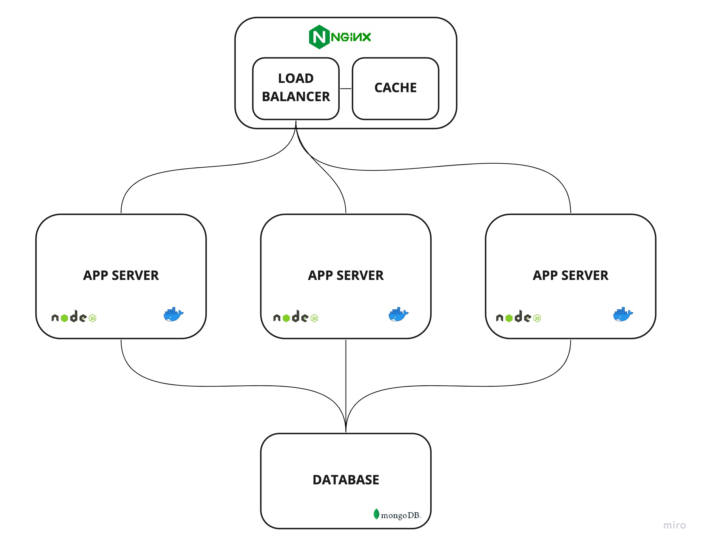

# Atelier


## Project Summary

API Service to provide product catalog data to the Atelier eCommerce client at production level traffic.

Designed and scaled multi-layer backend system improving performance of primary API endpoint from 640 rps to 4,900 rps (secondary endpoints: ~1000 rps to >7500 rps) for 1min using caching and load balancing (across 3 servers) through NGINX. Optimized queries to < 2ms in MongoDB.

## Performance Results

- Single-server Deployment

| Endpoint                        | Performance (RPS / Latency (ms) / Error Rate (%)) |
|---------------------------------|---------------------------------------------------|
| `/products`                     | 640 / 840 / 0                                     |
| `/products/:product_id`         | 1,033 / 512 / 0                                   |
| `/products/:product_id/styles`  | 884 / 603 / 0                                     |
| `/products/:product_id/related` | 1,050 / 504 / 0                                   |

- Multi-server Deployment

| Endpoint                        | Performance (RPS / Latency (ms) / Error Rate (%)) |
|---------------------------------|---------------------------------------------------|
| `/products`                     | 4,880 / 202 / 0.1                                 |
| `/products/:product_id`         | 6,967 / 90 / 0                                    |
| `/products/:product_id/styles`  | 5,414 / 115 / 0                                   |
| `/products/:product_id/related` | 7,540 / 122 / 0.2                                 |

## Application Architecture



## Installation

- clone this repository to a local directory
- run `npm install`
- create a `.env` file and add the following properties:
	```
	MONGO_USERNAME="DB_USERNAME"
	MONGO_PASSWORD="DB_PASSWORD"
	MONGO_IP="LOCALHOST_OR_IP_OF_DB"
	MONGO_AUTH_DB="DB_FOR_AUTHENTICATION"
	```
- run `npm start`
- navigate to `localhost:3500` and follow the instructions

## API Endpoints

### List Products

`GET /products`
Retrieves the list of products.

Parameters

| Parameter | Type    | Description                                               |
| --------- | ------- | --------------------------------------------------------- |
| page      | integer | Selects the page of results to return.  Default 1.        |
| count     | integer | Specifies how many results per page to return. Default 5. |

Response

`Status: 200 OK `

```json
[
  {
		"id": 1,
		"name": "Camo Onesie",
		"slogan": "Blend in to your crowd",
		"description": "The So Fatigues will wake you up and fit you in. This high energy camo will have you blending in to even the wildest surroundings.",
		"category": "Jackets",
		"default_price": "140"
	},
  {
		"id": 2,
		"name": "Bright Future Sunglasses",
		"slogan": "You've got to wear shades",
		"description": "Where you're going you might not need roads, but you definitely need some shades. Give those baby blues a rest and let the future shine bright on these timeless lenses.",
		"category": "Accessories",
		"default_price": "69"
	},
  {
		"id": 3,
		"name": "Morning Joggers",
		"slogan": "Make yourself a morning person",
		"description": "Whether you're a morning person or not. Whether you're gym bound or not. Everyone looks good in joggers.",
		"category": "Pants",
		"default_price": "40"
	},
	// ...
]
```

### Product Information

Returns all product level information for a specified product id.

`GET /products/:product_id`

Parameters

| Parameter  | Type    | Description                          |
| ---------- | ------- | ------------------------------------ |
| product_id | integer | Required ID of the Product requested |

Response

`Status: 200 OK `

```json
{
	"id": 11,
	"name": "Air Minis 250",
	"slogan": "Full court support",
	"description": "This optimized air cushion pocket reduces impact but keeps a perfect balance underfoot.",
	"category": "Basketball Shoes",
	"default_price": "0",
	"features": [
  	{
			"feature": "Sole",
			"value": "Rubber"
		},
  	{
			"feature": "Material",
			"value": "FullControlSkin"
		},
  	// ...
	],
}
```

### Product Styles

Returns the all styles available for the given product.

`GET /products/:product_id/styles`

Parameters

| Parameter  | Type    | Description                          |
| ---------- | ------- | ------------------------------------ |
| product_id | integer | Required ID of the Product requested |

Response

`Status: 200 OK `

```json
{
	"product_id": "1",
	"results": [
  	{
			"style_id": 1,
			"name": "Forest Green & Black",
			"original_price": "140",
			"sale_price": "0",
			"default?": 1,
			"photos": [
  			{
					"thumbnail_url": "urlplaceholder/style_1_photo_number_thumbnail.jpg",
					"url": "urlplaceholder/style_1_photo_number.jpg"
				},
  			{
					"thumbnail_url": "urlplaceholder/style_1_photo_number_thumbnail.jpg",
					"url": "urlplaceholder/style_1_photo_number.jpg"
				}
  			// ...
			],
      "skus": {
                "37": {
                      "quantity": 8,
                      "size": "XS"
                },
                "38": {
                      "quantity": 16,
                      "size": "S"
                },
                "39": {
                      "quantity": 17,
                      "size": "M"
                },
                //...
              }
    },
    {
      "style_id": 2,
      "name": "Desert Brown & Tan",
      "original_price": "140",
      "sale_price": "0",
      "default?": 0,
      "photos": [
          {
            "thumbnail_url": "urlplaceholder/style_2_photo_number_thumbnail.jpg",
            "url": "urlplaceholder/style_2_photo_number.jpg"
          }
        // ...
        ],
      "skus": {
                "37": {
                      "quantity": 8,
                      "size": "XS"
                },
                "38": {
                      "quantity": 16,
                      "size": "S"
                },
                "39": {
                      "quantity": 17,
                      "size": "M"
                },
                //...
              }
    },
    // ...
  ]
}
```


### Related Products

Returns the id's of products related to the product specified.

`GET /products/:product_id/related`

Parameters

| Parameter  | Type    | Description                          |
| ---------- | ------- | ------------------------------------ |
| product_id | integer | Required ID of the Product requested |

Response

`Status: 200 OK `

```json
[
  2,
  3,
  8,
  7
],
```
